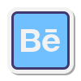

<!--  -->

## **Hi , I'm Yasmin Costa**

- 💻 I'm a UX/UI Designer
- ⚛️ HTML | CSS | JavaScript
- 📝 I'm graduated in Performing Arts
- ✨ I try to help people who are studying design on [Instagram](https://www.instagram.com/yasmincosta.design)
- 📫 How to reach me: [my site](https://www.yasmincosta.com), [linkedIn](https://www.linkedin.com/in/costayasmin/) or [instagram](https://www.instagram.com/ysaacosta/)

 
 

### **Contact Me**

